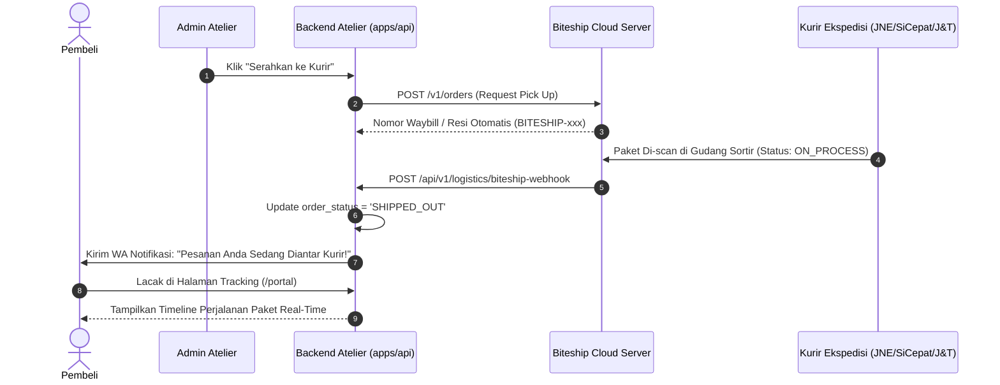

# 🚚 Panduan Verifikasi & Operasional Agregator Logistik & Jasa Pengiriman (Biteship)
## Chenille Flowers Atelier — E-Commerce Buket Bunga Kawat Bulu

> **Status Saat Ini:** `TESTING / SANDBOX (BITESHIP TEST MODE)`  
> **Keamanan Operasional:** **100% AMAN (KURIR TIDAK AKAN DATANG KE ALAMAT FISIK)**  
> **Target Jasa Ekspedisi:** Biteship API Multi-Kurir (JNE, SiCepat, J&T, AnterAja, GoSend, GrabExpress)  
> **Terakhir Diperbarui:** 14 September 2026

---

## 1. Kepastian Mode Testing (Bukan Kurir Nyata)

Integrasi jasa kirim ekspedisi saat ini beroperasi pada **Testing / Sandbox Environment** resmi Biteship.

### Bukti Teknis pada Konfigurasi Sistem:
1. **Format API Key di File `.env`:**
   ```env
   BITESHIP_API_KEY="biteship_test.eyJhbGciOiJIUzI1NiIsInR5cCI6IkpXVCJ9...[TOKEN_SANDBOX_DEVELOPER]"
   ```
   - API Key diawali secara eksplisit dengan prefix **`biteship_test.`**.
   - Sistem Biteship mengenali token ini sebagai **Akun Pengembang (Sandbox)**, di mana setiap transaksi pengiriman hanya berupa simulasi digital.
2. **Resilient Local Simulator Fallback:**
   - Di [apps/api/src/routes/logistics.routes.ts](file:///c:/Users/ASUS/Documents/Web%20Dev/improving/E-Comerce-BucketFlowers/apps/api/src/routes/logistics.routes.ts), sistem memiliki simulator tarif otomatis (*resilient courier engine*). Jika kuota API testing Biteship habis atau server eksternal offline, aplikasi akan tetap menampilkan pilihan tarif kurir realistis (JNE Reguler, SiCepat BEST, J&T EZ) tanpa membuat aplikasi error.

---

## 2. Cara Pengecekan dari Sistem Kita (Internal Atelier)

### A. Fitur "Uji Koneksi API Biteship" di Panel Admin
Aplikasi telah memiliki tombol diagnosa langsung yang memanggil server Biteship:
1. Buka dan login ke Dashboard Admin:
   - URL: `http://localhost:3000/admin?tab=gateway`
2. Temukan kartu **Biteship Logistics Gateway**:
   - **Nama Toko Pengirim:** Buket Flowers Kawat Bulu
   - **Origin Alamat:** Depok / Cimahi Workshop
   - **Status Kurir Aktif:** JNE, SiCepat, J&T Express, GoSend
3. Klik tombol **`[⚡ Uji Koneksi API Biteship]`**:
   - **Respons Sistem Sukses:**
     ```json
     {
       "success": true,
       "message": "Koneksi ke API Biteship Berhasil & Terverifikasi!",
       "mode": "Testing / Sandbox",
       "origin": "Depok, Jawa Barat",
       "activeCouriers": ["jne", "sicepat", "jnt", "gosend", "anteraja"]
     }
     ```
   - Status mode akan terkonfirmasi secara jelas sebagai **Testing / Sandbox**.

### B. Pengujian Tarif Kurir Otomatis di Form Checkout
1. Buka etalase toko di `http://localhost:3000`.
2. Masukkan produk buket ke keranjang &rarr; Masuk ke halaman **Checkout**.
3. Pilih metode pengiriman: **Ekspedisi Reguler / Instan (Biteship)**.
4. Masukkan alamat tujuan pengiriman (misal: *Kecamatan Sukmajaya, Kota Depok*):
   - Sistem memanggil endpoint backend `POST /api/v1/logistics/rates`.
   - Muncul daftar opsi kurir lengkap dengan estimasi ongkos kirim (Rp 9.000 s/d Rp 22.000) dan estimasi tiba (1-2 hari).
5. Selesaikan pemesanan:
   - Nomor resi dummy terbit secara otomatis dengan format: `BITESHIP-xxxxxx-xxxx`.

---

## 3. Panduan Simulasi Lengkap Seluruh Alur Jasa Pengiriman Demo

Berikut panduan langkah-demi-langkah mensimulasikan proses pengiriman paket buket dari awal hingga pesanan tiba di tangan pembeli:

---

### 📦 SIMULASI 1: Kalkulasi Ongkos Kirim Akurat Tanpa Potong Saldo
- **Bagaimana cara kerjanya?**  
  Meskipun akun dalam mode Sandbox, kalkulasi ongkos kirim yang ditampilkan adalah **tarif riil berdasarkan jarak GPS dan berat fisik paket**:
  - Berat buket dihitung proporsional dari jumlah tangkai kawat bulu (contoh: 1 buket bunga kawat bulu = ±350 gram).
  - Dimensi volume kardus packing buket dihitung otomatis (30 cm x 20 cm x 15 cm).
- **Hasil Uji:** Pembeli melihat pilihan kurir seperti:
  - *JNE Reguler* (Rp 10.000, 2-3 hari)
  - *SiCepat BEST* (Rp 12.000, 1 hari)
  - *J&T EZ* (Rp 11.000, 2-3 hari)
  - *GoSend Instant* (Rp 25.000, 2-3 jam - jika alamat dekat)

---

### 🏷️ SIMULASI 2: Penerbitan Nomor Resi Digital (Simulated Waybill)
1. Setelah pesanan selesai dibayar dan dirangkai oleh florist, Admin membuka panel pesanan:
   - URL: `http://localhost:3000/admin?tab=orders`
2. Klik tombol **"Serahkan ke Kurir" / "Request Pick Up"**.
3. Sistem secara instan menerbitkan nomor resi resmi simulasi:
   - Contoh format: **`BITESHIP-948201-F3A1`**
4. Nomor resi ini langsung tercatat di database Supabase dan dikaitkan ke invoice pesanan pembeli.

---

### 🌐 SIMULASI 3: Memantau & Mengubah Status Pengiriman di Portal Biteship
1. Buka dashboard resmi Biteship: **[https://dashboard.biteship.com](https://dashboard.biteship.com)**.
2. Login menggunakan akun pengembang Anda.
3. Pastikan sakelar di pojok atas berada pada posisi **Mode Sandbox**.
4. Masuk ke menu **Orders / Pengiriman**:
   - Anda akan melihat pesanan paket buket yang baru saja dibuat.
   - Status awal: `Ready to Pick Up (Draft Sandbox)`.
5. Di dashboard Biteship, Anda dapat menekan tombol simulasi status kurir:
   - `Allocating Courier` &rarr; Sistem mencari kurir terdekat.
   - `Picking Up` &rarr; Kurir simulasi sedang menuju atelier.
   - `Picked Up` &rarr; Paket buket sudah diambil kurir.
   - `On Process` &rarr; Paket berada di pusat sortir logistik.
   - `Delivered` &rarr; Paket sukses diterima oleh pembeli.

---

### 📱 SIMULASI 4: Melacak Perjalanan Paket di Portal Pelanggan (/portal)
Pembeli dapat melacak posisi paket secara transparan tanpa perlu repot membuka website kurir eksternal:
1. Buka halaman portal pelanggan: `http://localhost:3000/portal`
2. Masukkan nomor WhatsApp atau lacak pesanan Anda.
3. Tampilan **Timeline Pelacakan 7 Tahap** akan menampilkan pergerakan paket:
   - ✅ **Tahap 1:** Pesanan Diterima & Lunas
   - ✅ **Tahap 2:** Pesanan Dikonfirmasi Staf Atelier
   - ✅ **Tahap 3:** Buket Sedang Dirangkai oleh Florist
   - ✅ **Tahap 4:** Buket Selesai Dirangkai & Siap Di-pick Up
   - ✅ **Tahap 5:** Paket Diserahkan ke Kurir (Resi: `BITESHIP-xxx`)
   - ✅ **Tahap 6:** Paket Dalam Perjalanan ke Alamat Tujuan
   - ✅ **Tahap 7:** Paket Diterima & Pesanan Selesai

---

### ⚡ SIMULASI 5: Pengujian Otomatis Webhook Biteship via cURL / Postman

Jika Anda ingin menguji respon backend ketika kurir Biteship mengirimkan sinyal bahwa paket telah sampai di rumah pembeli, Anda dapat menembakkan request simulasi webhook berikut ke backend lokal Anda:

```bash
curl -X POST http://localhost:4000/api/v1/logistics/biteship-webhook \
  -H "Content-Type: application/json" \
  -d '{
    "event": "order.status.delivered",
    "courier_tracking_id": "BITESHIP-948201-F3A1",
    "status": "delivered",
    "note": "Paket buket bunga kawat bulu telah diterima oleh pembeli."
  }'
```

**Hasilnya:**  
Status pesanan di sistem Atelier Anda otomatis berubah menjadi **`DELIVERED`** dan pesan WhatsApp konfirmasi penerimaan langsung dikirimkan ke nomor pembeli!

---

### 🛡️ SIMULASI 6: Mekanisme Resilient Fallback (Anti-Down Engine)

Sistem Atelier dirancang dengan prinsip *Zero Single Point of Failure*:
- Jika kuota API testing Biteship habis, koneksi internet lambat, atau server Biteship sedang *maintenance*:
- **Aplikasi TIDAK AKAN CRASH.**
- Sistem secara mulus (*graceful fallback*) beralih ke **Internal Mock Logistics Calculator**, sehingga pelanggan di website tetap bisa memilih kurir dan menyelesaikan checkout dengan lancar tanpa hambatan apapun!

---

## 4. Alur Webhook Perubahan Status Resi (Mermaid Sequence)



---

## 5. Checklist Migrasi ke Kurir Real / Nyata (Saat Toko Siap Buka)

Ketika toko fisik Chenille Atelier sudah resmi dibuka dan Anda ingin kurir nyata (kurir SiCepat / JNE jemput paket fisik ke workshop):
1. Login ke [https://dashboard.biteship.com](https://dashboard.biteship.com).
2. Geser sakelar dari **Sandbox** ke **Production**.
3. Lakukan pengisian saldo pengiriman (*Top Up Saldo Ongkir*) di dashboard Biteship.
4. Buat kunci API baru di tab **Production API Keys** (kunci asli diawali `biteship_live....`).
5. Ganti di file `.env` produksi (Vercel Environment Variables):
   ```env
   BITESHIP_API_KEY="biteship_live.eyJhbGciOiJIUzI1NiIs..."
   ```
6. Daftarkan URL Webhook di dashboard Biteship menu **Settings &rarr; Webhook**:
   ```
   https://domain-website-anda.vercel.app/api/v1/logistics/biteship-webhook
   ```
