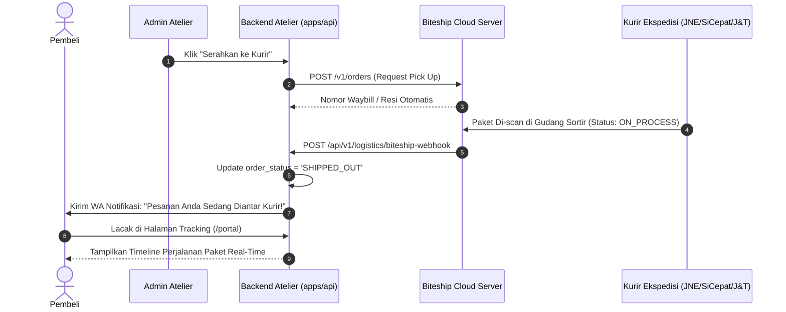

# 🚚 Panduan Verifikasi & Operasional Agregator Logistik & Jasa Pengiriman (Biteship)
## Chenille Flowers Atelier — E-Commerce Buket Bunga Kawat Bulu

> **Status Saat Ini:** `TESTING / SANDBOX (BITESHIP TEST MODE)`  
> **Keamanan Operasional:** **100% AMAN (KURIR TIDAK AKAN DATANG KE ALAMAT FISIK)**  
> **Target Jasa Ekspedisi:** Biteship API Multi-Kurir (JNE, SiCepat, J&T, AnterAja, GoSend, GrabExpress)  
> **Terakhir Diperbarui:** 14 September 2026

---

## 1. Kepastian Mode Testing (Bukan Kurir Nyata)

Integrasi jasa kirim ekspedisi saat ini beroperasi pada **Testing / Sandbox Environment** resmi Biteship.

### Bukti Teknis pada Konfigurasi Sistem:
1. **Format API Key di File `.env`:**
   ```env
   BITESHIP_API_KEY="biteship_test.eyJhbGciOiJIUzI1NiIsInR5cCI6IkpXVCJ9...[TOKEN_SANDBOX_DEVELOPER]"
   ```
   - API Key diawali secara eksplisit dengan prefix **`biteship_test.`**.
   - Sistem Biteship mengenali token ini sebagai **Akun Pengembang (Sandbox)**, di mana transaksi order pengiriman hanya bersifat simulasi digital.
2. **Resilient Local Simulator Fallback:**
   - Di [apps/api/src/routes/logistics.routes.ts](file:///c:/Users/ASUS/Documents/Web%20Dev/improving/E-Comerce-BucketFlowers/apps/api/src/routes/logistics.routes.ts), sistem memiliki simulator tarif otomatis (*resilient courier engine*). Jika kuota API testing Biteship habis atau server eksternal offline, aplikasi akan tetap menampilkan pilihan tarif kurir realistis (JNE Reguler, SiCepat BEST, J&T EZ) tanpa membuat aplikasi error.

---

## 2. Cara Pengecekan dari Sistem Kita (Internal Atelier)

### A. Fitur "Uji Koneksi API Biteship" di Panel Admin
Aplikasi telah memiliki tombol diagnosa langsung yang memanggil server Biteship:
1. Buka dan login ke Dashboard Admin:
   - URL: `http://localhost:3000/admin?tab=gateway`
2. Temukan kartu **Biteship Logistics Gateway**:
   - **Nama Toko Pengirim:** Buket Flowers Kawat Bulu
   - **Origin Alamat:** Depok / Cimahi Workshop
   - **Status Kurir Aktif:** JNE, SiCepat, J&T Express, GoSend
3. Klik tombol **[⚡ Uji Koneksi API Biteship]**:
   - **Respons Sistem Sukses:**
     ```json
     {
       "success": true,
       "message": "Koneksi ke API Biteship Berhasil & Terverifikasi!",
       "mode": "Testing / Sandbox",
       "origin": "Depok, Jawa Barat",
       "activeCouriers": ["jne", "sicepat", "jnt", "gosend", "anteraja"]
     }
     ```
   - Status mode akan terkonfirmasi secara jelas sebagai **Testing / Sandbox**.

### B. Pengujian Tarif Kurir Otomatis di Form Checkout
1. Buka etalase toko di `http://localhost:3000`.
2. Masukkan produk buket ke keranjang &rarr; Masuk ke halaman **Checkout**.
3. Pilih metode pengiriman: **Ekspedisi Reguler / Instan (Biteship)**.
4. Masukkan alamat tujuan pengiriman (misal: *Kecamatan Sukmajaya, Kota Depok*):
   - Sistem akan memanggil endpoint `POST /api/v1/logistics/rates`.
   - Muncul daftar opsi kurir lengkap dengan estimasi ongkos kirim (Rp 9.000 s/d Rp 22.000) dan estimasi tiba (1-2 hari).
5. Selesaikan pemesanan:
   - Nomor resi dummy terbit secara otomatis dengan format: `BITESHIP-xxxxxx-xxxx`.

---

## 3. Cara Pengecekan dari Sistem Biteship (Eksternal)

### A. Memeriksa Token di Dashboard Resmi Biteship
1. Buka portal pengembang Biteship: [https://dashboard.biteship.com](https://dashboard.biteship.com).
2. Login menggunakan akun pengembang Anda.
3. Buka menu **Integrasi / API Keys**:
   - Periksa tab **Sandbox / Testing**.
   - Cocokkan nama toko: **Buket Flowers Kawat Bulu**.
   - Anda akan melihat API Key yang sama persis dengan yang ada di file `.env` aplikasi Anda.

### B. Memantau Pesanan Pengiriman Uji Coba di Biteship
1. Masuk ke menu **Orders / Pengiriman** di Dashboard Biteship.
2. Di pojok atas, pastikan sakelar berada pada mode **Sandbox / Mode Uji Coba**.
3. Setiap kali Anda melakukan checkout dengan ekspedisi di aplikasi lokal, pesanan simulasi akan tercatat di dashboard Biteship lengkap dengan:
   - Alamat pengirim (Atelier Kawat Bulu).
   - Alamat penerima pembeli.
   - Bobot paket (dihitung proporsional berdasarkan jumlah tangkai kawat bulu).
   - Status: `Draft / Ready to Pick Up (Simulation)`.

---

## 4. Alur Webhook Perubahan Status Resi (Tracking Stepper)

Sistem Atelier mendukung sinkronisasi status pengiriman otomatis dari kurir:



---

## 5. Checklist Migrasi ke Kurir Real / Nyata (Saat Siap Rilis)

Jika nanti toko fisik Chenille Atelier sudah resmi buka dan Anda ingin kurir nyata (misal: kurir SiCepat / JNE jemput paket fisik ke workshop):
1. Login ke [https://dashboard.biteship.com](https://dashboard.biteship.com).
2. Geser sakelar dari **Sandbox** ke **Production**.
3. Lakukan pengisian saldo pengiriman (*Top Up Saldo Ongkir*) di dashboard Biteship.
4. Buat kunci API baru di tab **Production API Keys** (kunci asli diawali `biteship_live....`).
5. Ganti di file `.env` produksi (Vercel Environment Variables):
   ```env
   BITESHIP_API_KEY="biteship_live.eyJhbGciOiJIUzI1NiIs..."
   ```
6. Daftarkan URL Webhook di dashboard Biteship menu **Settings &rarr; Webhook**:
   ```
   https://domain-website-anda.vercel.app/api/v1/logistics/biteship-webhook
   ```
