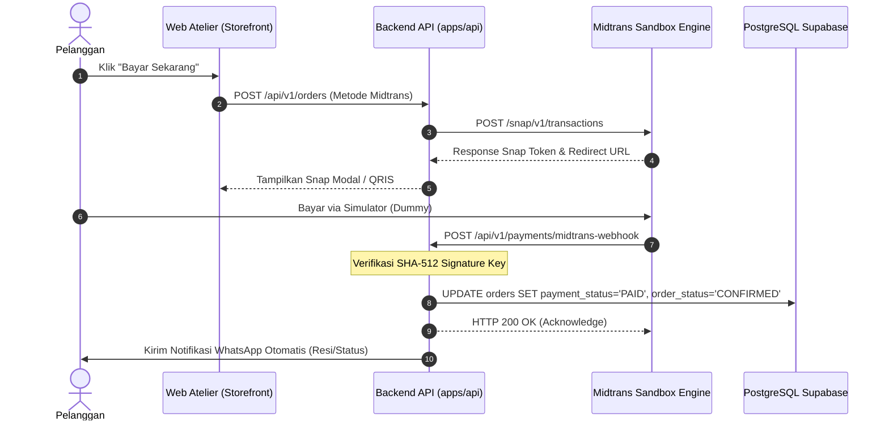

# 💳 Panduan Verifikasi & Operasional Payment Gateway (Midtrans Snap)
## Chenille Flowers Atelier — E-Commerce Buket Bunga Kawat Bulu

> **Status Saat Ini:** `DEMO / TESTING / SANDBOX`  
> **Keamanan Saldo:** **100% AMAN (TIDAK MEMOTONG UANG ASLI)**  
> **Target Gateway:** Midtrans Snap (QRIS, GoPay, BCA/BNI/Mandiri VA, Credit Card)  
> **Terakhir Diperbarui:** 14 September 2026

---

## 1. Kepastian Mode Sandbox (Bukan Real)

Sistem pembayaran yang terpasang pada aplikasi saat ini beroperasi penuh dalam **Sandbox / Simulation Environment**.

### Bukti Teknis pada Konfigurasi Sistem:
1. **File `.env`:**
   ```env
   MIDTRANS_IS_PRODUCTION="false"
   MIDTRANS_SERVER_KEY="SB-Mid-server-xxxxxxxxxxxxxxxxxxxxxxxx"
   MIDTRANS_CLIENT_KEY="SB-Mid-client-xxxxxxxxxxxxxxxxxxxxxxxx"
   MIDTRANS_MERCHANT_ID="M602203518"
   ```
   - Nilai `MIDTRANS_IS_PRODUCTION="false"` secara tegas mengarahkan semua panggilan API ke server uji coba Midtrans.
2. **Endpoint Gateway yang Dituju:**
   - **Sandbox URL (Aktif Saat Ini):** `https://app.sandbox.midtrans.com/snap/v1/transactions`
   - **Production URL (Hanya Jika Nyata):** `https://app.midtrans.com/snap/v1/transactions`
3. **Resilient Mock Fallback:**
   - Jika koneksi internet terputus atau server Midtrans Sandbox sedang sibuk, backend Node.js (`apps/api/src/routes/payment.routes.ts`) secara otomatis membangkitkan *simulation token* sehingga pengujian checkout pelanggan tidak akan pernah terhenti (anti-crash).

---

## 2. Cara Pengecekan dari Sistem Kita (Internal Atelier)

### A. Melalui Panel Admin Atelier
1. Buka browser dan login ke akun Admin:
   - URL: `http://localhost:3000/auth/login`
   - Email: `admin@chenilleatelier.com` | Password: `admin123`
2. Masuk ke tab **Gateway & Integrasi**:
   - URL Langsung: `http://localhost:3000/admin?tab=gateway`
3. Periksa kartu **Midtrans Payment Gateway**:
   - **Merchant ID:** `M602203518`
   - **Client Key:** `Mid-client-Xi4Kpe2...`
   - **Server Key:** Ter-masking rapi (`Mid-server-***`)
   - **Biaya Admin:** Rp 2.500

### B. Melalui Skenario Checkout Pembeli (Storefront)
1. Buka etalase toko di `http://localhost:3000`.
2. Masukkan salah satu produk buket ke keranjang (misal: *Buket Mawar Velvet Merah*).
3. Klik tombol **Checkout**:
   - Isi nama dan nomor WhatsApp pembeli.
   - Pada metode pembayaran, pilih **Midtrans Snap (QRIS / Transfer Bank)**.
4. Klik **Bayar Sekarang**:
   - Muncul pop-up resmi **Midtrans Snap Sandbox**.
   - Perhatikan pada header pop-up Midtrans terdapat label **"TEST MODE / SANDBOX"**.

---

## 3. Cara Pengecekan dari Sistem Midtrans (Eksternal)

### A. Menggunakan Midtrans Technical Payment Simulator
Midtrans menyediakan halaman simulator resmi untuk menyelesaikan pembayaran dummy tanpa uang sepeserpun:
👉 **URL Simulator:** [https://simulator.sandbox.midtrans.com](https://simulator.sandbox.midtrans.com)

#### 1. Simulasi Pembayaran Virtual Account (BCA / BNI / BRI / Mandiri)
- Saat modal Snap menampilkan nomor Virtual Account uji coba (contoh: `1234567890123456`), salin nomor tersebut.
- Buka [Midtrans VA Simulator](https://simulator.sandbox.midtrans.com/bca/va/index).
- Tempelkan nomor VA &rarr; Klik **Inquire** &rarr; Klik **Pay**.
- Dalam waktu 1-2 detik, status pesanan di sistem Atelier Anda otomatis berubah menjadi **LUNAS (PAID)** via Webhook!

#### 2. Simulasi Pembayaran QRIS (GoPay / ShopeePay)
- Di pop-up Snap, pilih metode QRIS.
- Buka [Midtrans QRIS Simulator](https://simulator.sandbox.midtrans.com/qris/index).
- Pindai kode QR yang tampil di layar atau salin URL QR code &rarr; Klik **Pay**.

#### 3. Simulasi Kartu Kredit Dummy (Testing Card)
Jika memilih metode Kartu Kredit pada pop-up Snap, gunakan kredensial dummy resmi berikut:
| Parameter | Nilai Uji Coba |
| :--- | :--- |
| **Card Number** | `4811 1111 1111 1114` |
| **CVV** | `123` |
| **Expiry Date** | Bulan/Tahun masa depan (misal: `12/28`) |
| **OTP 3D Secure** | `112233` |

### B. Memantau Transaksi di Dashboard Resmi Midtrans
1. Buka [https://dashboard.sandbox.midtrans.com](https://dashboard.sandbox.midtrans.com).
2. Login menggunakan akun Midtrans pengembang Anda.
3. Masuk ke menu **Transactions**:
   - Anda akan melihat daftar transaksi pesanan dari Chenille Flowers Atelier.
   - Kolom **Status** akan menampilkan `Settlement` (jika sudah disimulasikan lunas) atau `Pending` (jika baru dibuat).
4. Klik salah satu Order ID untuk melihat detail payload webhook, IP pemanggil, dan tipe pembayaran.

---

## 4. Alur Webhook Notifikasi Otomatis

Sistem Atelier telah dilengkapi pendengar Webhook resmi berstandar industri dengan enkripsi SHA-512 Signature:



---

## 5. Checklist Migrasi ke Mode Production (Jika Nanti Siap Rilis)

Ketika toko siap menerima pembayaran uang asli dari pelanggan publik:
1. Login ke [https://dashboard.midtrans.com](https://dashboard.midtrans.com) (Mode Production).
2. Selesaikan KYC / upload dokumen legalitas bisnis (KTP / Rekening Bank Pencairan).
3. Salin kunci resmi produksi dari menu **Settings &rarr; Access Keys**:
   - Production Client Key
   - Production Server Key
4. Ubah di file `.env` produksi (Vercel Environment Variables):
   ```env
   MIDTRANS_IS_PRODUCTION="true"
   MIDTRANS_SERVER_KEY="Mid-server-ProductionKeyAsliAnda..."
   MIDTRANS_CLIENT_KEY="Mid-client-ProductionKeyAsliAnda..."
   MIDTRANS_MERCHANT_ID="Gxxxxxxxxx"
   ```
5. Di Dashboard Midtrans menu **Settings &rarr; Configuration**, daftarkan URL Webhook:
   ```
   https://domain-website-anda.vercel.app/api/v1/payments/midtrans-webhook
   ```
