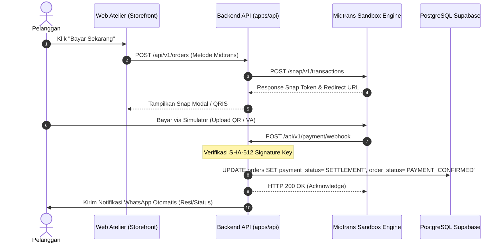

# 💳 Panduan Verifikasi & Operasional Payment Gateway (Midtrans Snap & Metode Toko)
## Chenille Flowers Atelier — E-Commerce Buket Bunga Kawat Bulu

> **Status Saat Ini:** `DEMO / TESTING / SANDBOX`  
> **Keamanan Saldo:** **100% AMAN (TIDAK MEMOTONG UANG ASLI)**  
> **Target Gateway:** Midtrans Snap (QRIS, GoPay, BCA/BNI/Mandiri VA, Credit Card) & Metode Lokal (Manual BCA, COD Titik Temu)  
> **Terakhir Diperbarui:** 14 September 2026

---

## 1. Kepastian Mode Sandbox (Bukan Real)

Sistem pembayaran yang terpasang pada aplikasi saat ini beroperasi penuh dalam **Sandbox / Simulation Environment**.

### Bukti Teknis pada Konfigurasi Sistem:
1. **File `.env`:**
   ```env
   MIDTRANS_IS_PRODUCTION="false"
   MIDTRANS_SERVER_KEY="SB-Mid-server-xxxxxxxxxxxxxxxxxxxxxxxx"
   MIDTRANS_CLIENT_KEY="SB-Mid-client-xxxxxxxxxxxxxxxxxxxxxxxx"
   MIDTRANS_MERCHANT_ID="M602203518"
   ```
   - Nilai `MIDTRANS_IS_PRODUCTION="false"` secara tegas mengarahkan seluruh panggilan API ke server uji coba Midtrans.
2. **Endpoint Gateway yang Dituju:**
   - **Sandbox URL (Aktif Saat Ini):** `https://app.sandbox.midtrans.com/snap/v1/transactions`
   - **Production URL (Hanya Jika Nyata):** `https://app.midtrans.com/snap/v1/transactions`
3. **Resilient Mock Fallback:**
   - Jika koneksi internet terputus atau server Midtrans Sandbox sedang sibuk, backend Node.js (`apps/api/src/routes/payment.routes.ts`) secara otomatis membangkitkan *simulation token* sehingga pengujian checkout pelanggan tidak akan pernah terhenti (anti-crash).

---

## 2. Cara Pengecekan dari Sistem Kita (Internal Atelier)

### A. Melalui Panel Admin Atelier
1. Buka browser dan login ke akun Admin:
   - URL: `http://localhost:3000/auth/login`
   - Email: `admin@chenilleatelier.com` | Password: `admin123`
2. Masuk ke tab **Gateway & Integrasi**:
   - URL Langsung: `http://localhost:3000/admin?tab=gateway`
3. Periksa kartu **Midtrans Payment Gateway**:
   - **Merchant ID:** `M602203518`
   - **Client Key:** `Mid-client-Xi4Kpe2...`
   - **Server Key:** Ter-masking rapi (`Mid-server-***`)
   - **Biaya Admin:** Rp 2.500

### B. Melalui Skenario Checkout Pembeli (Storefront)
1. Buka etalase toko di `http://localhost:3000`.
2. Masukkan salah satu produk buket ke keranjang (misal: *Buket Mawar Velvet Merah*).
3. Klik tombol **Checkout**:
   - Isi nama dan nomor WhatsApp pembeli.
   - Pada metode pembayaran, pilih opsi yang ingin diuji (Midtrans Snap, Manual BCA, atau COD).
4. Klik **Bayar Sekarang**:
   - Muncul pop-up resmi **Midtrans Snap Sandbox**.
   - Perhatikan pada header pop-up Midtrans terdapat label **"TEST MODE / SANDBOX"**.

---

## 3. Panduan Simulasi Lengkap Seluruh Metode Pembayaran Demo

Midtrans menyediakan simulator resmi web tanpa memerlukan uang asli sepeserpun:  
👉 **Portal Utama Simulator:** [https://simulator.sandbox.midtrans.com](https://simulator.sandbox.midtrans.com)

> ⚠️ **PERINGATAN PENTING UNTUK SEMUA METODE DEMO:**  
> Anda **TIDAK BOLEH** menggunakan aplikasi perbankan asli (BCA Mobile, Livin Mandiri) maupun e-wallet asli (GoPay, ShopeePay) di HP Anda untuk membayar transaksi Sandbox, karena sistem perbankan nyata akan menolak dengan notifikasi *"QR / Rekening Tidak Valid"*. Gunakan selalu alat simulasi resmi di bawah ini!

---

### 🟢 METODE 1: QRIS / GoPay (3 Cara Sukses & Solusi Masalah)

#### Mengapa Muncul *"Transaction is unsuccessful"* saat menempelkan link?
Kolom teks di halaman simulator QRIS Midtrans **BUKAN untuk menempelkan URL web** (`https://...`), melainkan untuk *raw string data*. Menempelkan URL gambar akan menyebabkan parser gagal mengenali QR code.

Gunakan salah satu dari **3 cara pasti berhasil** berikut:

#### 🌟 Cara 1A: Upload File Gambar QR Code (Paling Direkomendasikan)
1. Saat pop-up Snap menampilkan QR Code di layar, **klik kanan pada gambar QR** &rarr; pilih **"Save image as..."** (simpan file `qr.png`), atau gunakan *Snipping Tool / Screenshot* kotak QR-nya.
2. Buka simulator: **[https://simulator.sandbox.midtrans.com/qris/index](https://simulator.sandbox.midtrans.com/qris/index)**
3. Klik tombol **`Choose File`** / **`Browse`** &rarr; pilih file gambar QR tadi.
4. Klik tombol hijau **`Pay`**.
5. **Hasil:** Dalam 1-2 detik, pop-up Snap di toko Anda langsung berubah menjadi **"Pembayaran Berhasil! Pesanan Terkonfirmasi"**.

#### 📱 Cara 1B: Scan Kamera HP via Web Simulator
1. Buka link simulator di browser HP Anda: **[https://simulator.sandbox.midtrans.com/qris/index](https://simulator.sandbox.midtrans.com/qris/index)**
2. Klik tombol **"Scan QR with Camera"** di layar HP.
3. Arahkan kamera HP ke gambar QR Code yang tampil di layar laptop.
4. Simulator akan mendeteksi payload QRIS secara instan &rarr; Tekan tombol **`Pay`** di HP.

#### 🛵 Cara 1C: Menggunakan GoPay Partner App Simulator
1. Buka simulator GoPay: **[https://simulator.sandbox.midtrans.com/gopay/partner/app](https://simulator.sandbox.midtrans.com/gopay/partner/app)**
2. Masukkan Order ID pesanan Anda (contoh: `INV-20260914-7539`) atau scan QR.
3. Klik **Authorize & Pay**.

---

### ⚡ METODE 2: Virtual Account (BCA / BNI / BRI / Mandiri) — Paling Cepat & Anti-Gagal!

Metode ini adalah pilihan favorit developer untuk demo karena hanya memakan waktu **5 detik tanpa urusan gambar/kamera**:

1. Di pop-up Midtrans Snap, pilih **Bank Transfer** &rarr; pilih bank (contoh: **BCA Virtual Account**).
2. Salin nomor Virtual Account yang muncul (contoh: `9882203518123456`).
3. Buka halaman simulator sesuai bank:
   - **BCA VA:** [https://simulator.sandbox.midtrans.com/bca/va/index](https://simulator.sandbox.midtrans.com/bca/va/index)
   - **BNI VA:** [https://simulator.sandbox.midtrans.com/bni/va/index](https://simulator.sandbox.midtrans.com/bni/va/index)
   - **BRI VA:** [https://simulator.sandbox.midtrans.com/bri/va/index](https://simulator.sandbox.midtrans.com/bri/va/index)
   - **Mandiri Bill:** [https://simulator.sandbox.midtrans.com/mandiri/bill/index](https://simulator.sandbox.midtrans.com/mandiri/bill/index)
4. Tempelkan nomor VA &rarr; Klik **Inquire** &rarr; Klik **Pay**.
5. **Hasil:** Status pesanan di website Atelier seketika berubah menjadi **LUNAS (SETTLEMENT)** via Webhook.

---

### 💳 METODE 3: Kartu Kredit Testing (Credit Card Sandbox)

Jika pelanggan memilih opsi pembayaran Kartu Kredit pada pop-up Snap, gunakan kredensial kartu uji coba resmi berikut:

| Parameter Kartu | Nilai Demo Resmi Midtrans | Keterangan |
| :--- | :--- | :--- |
| **Card Number** | `4811 1111 1111 1114` | Nomor kartu VISA uji coba Sandbox |
| **Expiration Date** | Bulan & Tahun masa depan (misal: `12 / 28`) | Bebas asalkan belum lewat |
| **CVV / CVN** | `123` | 3 digit angka bebas |
| **Password OTP (3D Secure)** | `112233` | Masukkan saat pop-up Bank Mandiri/BCA OTP muncul |

---

### 🏦 METODE 4: Transfer Bank Manual Toko (BCA Chenille Atelier)

Metode ini tidak melalui Midtrans, melainkan alur transfer konvensional toko:
1. Saat checkout di Storefront, pilih metode **Transfer Manual Bank BCA**.
2. Nomor rekening atelier ditampilkan: `BCA 873-049-2811 a.n Ahmad Arif (Chenille Atelier)`.
3. Pembeli mengunggah struk/bukti transfer gambar (mock slip).
4. Status pesanan masuk sebagai `WAITING_VERIFICATION`.
5. Admin membuka **Admin Dashboard &rarr; Pesanan (`/admin?tab=orders`)**, memeriksa bukti transfer, lalu menekan tombol **"Verifikasi Pembayaran"** untuk mengubah status menjadi **LUNAS**.

---

### 🤝 METODE 5: COD (Cash on Delivery) Titik Temu

Metode pembayaran tunai langsung di lokasi:
1. Saat checkout, pembeli memilih opsi pengiriman **COD Titik Temu**.
2. Sistem memeriksa batas Geofencing radius **5.0 KM** dari Workshop.
3. Metode pembayaran otomatis terkunci ke **COD_CASH_ON_DELIVERY** dengan status awal `UNPAID`.
4. Pembayaran dilakukan secara fisik dengan uang tunai saat kurir/florist bertemu dengan pembeli di titik temu.
5. Florist/Admin menandai pesanan sebagai `COMPLETED` dan `PAID` di panel admin setelah uang fisik diterima.

---

## 4. Memantau Transaksi di Dashboard Resmi Midtrans

1. Buka [https://dashboard.sandbox.midtrans.com](https://dashboard.sandbox.midtrans.com).
2. Login menggunakan akun pengembang Midtrans.
3. Masuk ke menu **Transactions**:
   - Seluruh transaksi dari website lokal akan tercatat lengkap.
   - Kolom **Status** akan menampilkan:
     - `Settlement`: Pembayaran telah berhasil dilunasi via simulator.
     - `Pending`: Pembayaran baru dibuat dan menunggu diselesaikan.
     - `Expire`: Batas waktu bayar telah habis.
4. Klik baris transaksi untuk melihat detail log API, payload JSON, dan waktu webhook terkirim.

---

## 5. Arsitektur Webhook Notifikasi Otomatis



---

## 6. Checklist Migrasi ke Mode Production (Uang Asli)

Ketika bisnis sudah siap diluncurkan secara komersial:
1. Login ke [https://dashboard.midtrans.com](https://dashboard.midtrans.com) (Mode Production).
2. Selesaikan proses registrasi legalitas usaha (KTP & Buku Tabungan Pencairan Dana).
3. Ambil kredensial resmi dari menu **Settings &rarr; Access Keys**:
   - Production Client Key
   - Production Server Key
4. Ubah pengaturan di dashboard Vercel (**Environment Variables**):
   ```env
   MIDTRANS_IS_PRODUCTION="true"
   MIDTRANS_SERVER_KEY="Mid-server-ProductionAsliAnda..."
   MIDTRANS_CLIENT_KEY="Mid-client-ProductionAsliAnda..."
   MIDTRANS_MERCHANT_ID="Mxxxxxxxxx"
   ```
5. Daftarkan URL Webhook di dashboard Midtrans (**Settings &rarr; Configuration**):
   ```
   https://domain-anda.vercel.app/api/v1/payment/webhook
   ```
