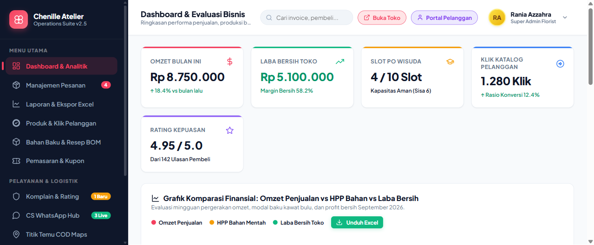
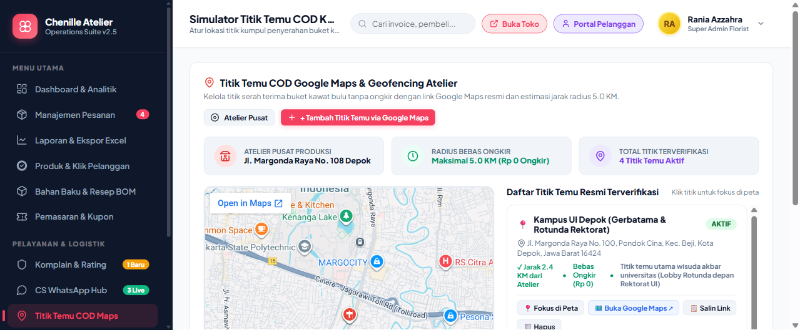
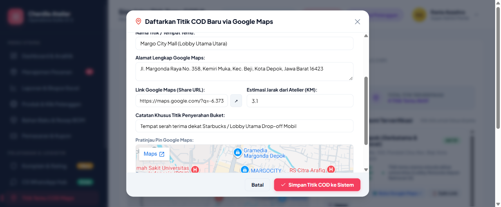
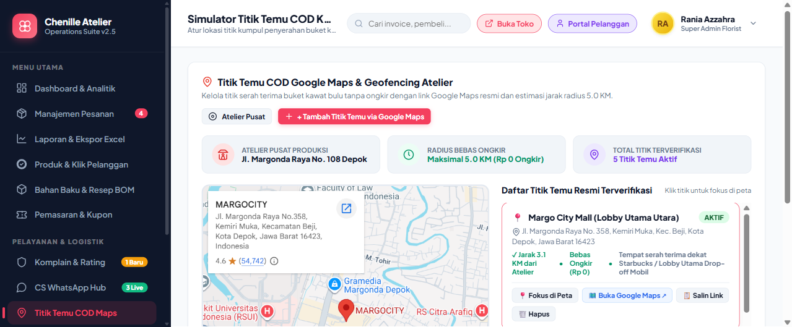
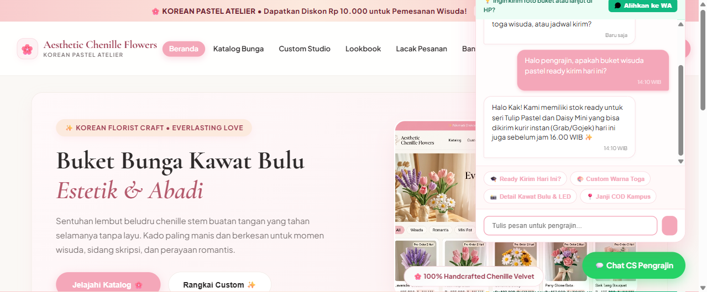
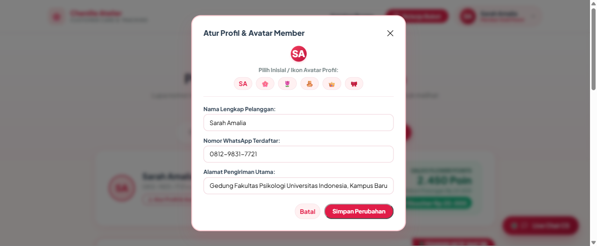
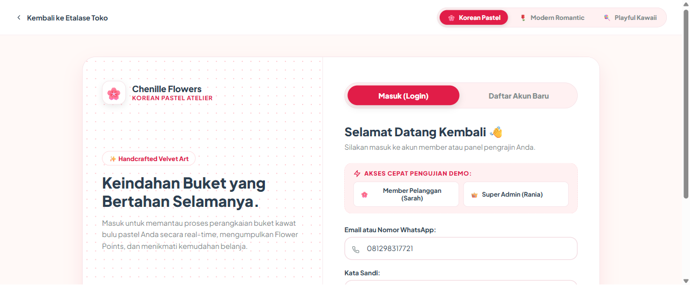
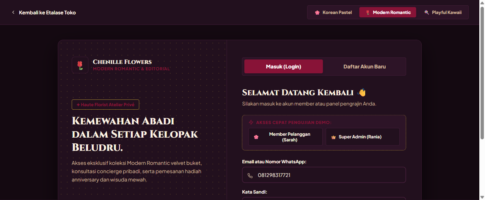
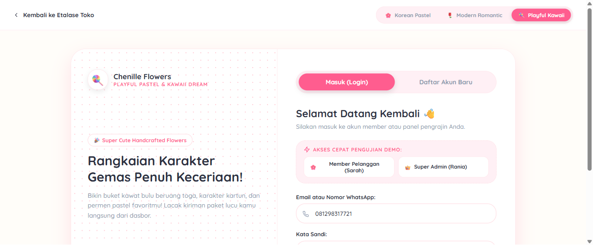

# 🌸 E-Commerce & Interactive Multi-Theme Catalog Buket Bunga Kawat Bulu

> **Aesthetic Chenille Flowers Atelier** — Solusi platform e-commerce dan operasional kerajinan tangan (*handicraft*) buket bunga kawat bulu (*chenille stems*) berstandar Shopify-Grade dengan integrasi Google Maps COD Geofencing, Multi-Theme Design Token Engine, Kalkulator Biaya Bahan Mentah (BOM), In-System Live Web Chat, dan Portal Member Pelanggan.

[](PRD.md)
[](PRD.md)
[](PRD.md)
[](PRD.md)
[](PRD.md)

---

## 📑 Daftar Isi

- [✨ Fitur Unggulan Sistem](#-fitur-unggulan-sistem)
- [📸 Galeri Tangkapan Layar & Verifikasi Tampilan](#-galeri-tangkapan-layar--verifikasi-tampilan)
- [📁 Struktur Folder & Navigasi Berkas](#-struktur-folder--navigasi-berkas)
- [🎭 Arsitektur Multi-Theme Engine](#-arsitektur-multi-theme-engine)
- [🗺️ Integrasi Titik Temu COD Google Maps](#️-integrasi-titik-temu-cod-google-maps)
- [🧵 Bill of Materials (BOM) & Finansial](#-bill-of-materials-bom--finansial)
- [👤 Dual-Scenario Portal Pelanggan](#-dual-scenario-portal-pelanggan)
- [🚀 Cara Menjalankan Aplikasi](#-cara-menjalankan-aplikasi)
- [📄 Spesifikasi Lengkap (PRD)](#-spesifikasi-lengkap-prd)

---

## ✨ Fitur Unggulan Sistem

### 1. 🎨 Multi-Theme Storefront (Tema A, B, & C)
Tersedia 3 tema visual independen yang dapat disinkronkan secara global melalui Admin Panel:
- **Tema A (Korean Pastel Atelier):** Lembut, elegan, soft blush & sage green, tipografi Outfit.
- **Tema B (Modern Romantic):** Mewah, dramatis, deep velvet wine `#722F37` & antique gold, tipografi Playfair Display.
- **Tema C (Playful Kawaii):** Ceria, pop pastel, bubblegum pink `#EC4899` & warm butter, tipografi Fredoka.

### 2. 🗺️ Titik Temu COD Terintegrasi Google Maps & Geofencing
- **Peta Interaktif Asli:** Peta Google Maps aktif terintegrasi di sisi admin dan checkout pembeli.
- **Deteksi Otomatis (Auto-Detect):** Cukup tempel tautan `maps.app.goo.gl` atau ketik nama tempat, sistem otomatis mengisi nama lokasi, alamat lengkap, tautan navigasi resmi, serta estimasi jarak (KM).
- **Preset 1-Klik:** UI Gerbatama, Margo City Mall, Stasiun KRL Pondok Cina, D'Mall Margonda, Kampus D Gunadarma.
- **Geofencing:** Radius 5.0 KM dari atelier bebas ongkos kirim (Rp 0).

### 3. 💬 In-System Live Web Chat (Anti-Direct-WA Trap)
- Pengunjung berkonsultasi langsung di dalam web tanpa dipaksa pindah ke WhatsApp di awal.
- Quick chips rekomendasi buket wisuda, panduan QRIS, dan garansi.
- Asisten florist cerdas otomatis dengan balasan real-time.
- Opsi eskalasi resmi *"Alihkan ke WA Pengrajin"* hanya jika pembeli ingin mengirimkan foto kustom buket.

### 4. 🧵 Bill of Materials (BOM) & Line Chart Finansial
- Modul kalkulasi modal kawat bulu per batang (Rp 250), boneka wisuda, kertas cellophane, dan pita satin.
- Menghitung HPP, harga jual, laba kotor, dan margin untung bersih secara akurat.
- Grafik garis SVG 3-garis interaktif: **Omzet (Pink)** vs **HPP Bahan (Amber)** vs **Laba Bersih (Emerald)**.

### 5. 👥 Dual-Scenario Customer Portal ("Admin Pelanggan")
- **Skenario 1 (Guest Checkout):** Lacak pesanan langsung cukup dengan Nomor WhatsApp tanpa beban password.
- **Skenario 2 (Registered Member):** Dashboard akun pribadi lengkap dengan avatar header (`SA`), modal ubah foto/emoji avatar (`🌸`, `🌷`, `🧸`, `👑`, `🎀`), **kartu pelacakan pesanan aktif stepper 4-tahap langsung**, saldo Flower Points loyalty, dan buku alamat.

### 6. 🔐 Halaman Login & Register Multi-Tema Dinamis
- Visual halaman login otomatis beradaptasi dengan warna, font, dan elemen tema toko aktif.
- Tombol pemilih tema langsung di halaman login.
- Tombol 1-Click Fast Login Demo untuk Member (Sarah Amalia) dan Super Admin (Rania Azzahra).

### 7. 🛠️ Header Admin Anti-Penyok & Profil Dropdown
- Avatar admin terkunci sempurna 1:1 circular (38x38px) dengan proteksi anti-squish.
- Dropdown menu interaktif: Profil Pengrajin, Pengaturan Atelier, Ganti Password, dan Logout.

---

## 📸 Galeri Tangkapan Layar & Verifikasi Tampilan

### A. Admin Operations Dashboard (Layout Bersih & Bebas Tumpang Tindih)
Header dengan avatar bulat sempurna `RA`, pencarian invoice, tombol Buka Toko, Portal Pelanggan, dan kartu KPI omzet.


### B. Titik Temu COD Google Maps & Geofencing Atelier
Peta Google Maps interaktif terintegrasi di sisi kiri dan daftar titik kumpul resmi di sisi kanan.


### C. Modal Tambah Titik COD via Google Maps (Auto-Detect & Live Preview)
Pencarian cepat atau paste tautan Google Maps dengan tombol preset populer dan live embed preview pin.


### D. Hasil Titik COD Tersimpan & Peta Otomatis Berfokus
Titik baru langsung tersimpan dengan badge status dan peta Google Maps langsung terfokus ke lokasi pin.


### E. In-System Live Web Chat di Etalase Toko
Widget chat interaktif di etalase toko yang menggantikan tautan direct WA eksternal.


### F. Portal Member Pelanggan (Avatar & Live Order Tracking Stepper)
Dashboard akun pelanggan dengan avatar inisial, stepper 4-tahap pengerjaan buket aktif, dan saldo Flower Points.


### G. Halaman Login Multi-Tema (Tema A, B, dan C)
| Tema A: Korean Pastel | Tema B: Modern Romantic | Tema C: Playful Kawaii |
| :---: | :---: | :---: |
|  |  |  |

---

## 📁 Struktur Folder & Navigasi Berkas

```text
E-Comerce-BucketFlowers/
├── PRD.md                           # Dokumen Persyaratan Produk (PRD v2.0)
├── README.md                        # Dokumentasi Utama Repository
├── .gitignore                       # File Ignored Git
├── docs/
│   └── screenshots/                 # Tangkapan Layar Verifikasi E2E
│
└── desain-tampilan/                 # Prototipe Antarmuka Lengkap
    ├── login/
    │   └── index.html               # Halaman Login & Register Multi-Tema Dinamis
    │
    ├── admin-dashboard/
    │   └── index.html               # Dashboard Operasional Admin v2.6
    │
    ├── customer-portal/
    │   └── index.html               # Portal Pelanggan & Tracking Dual-Skenario
    │
    ├── tema-a-korean-pastel/
    │   └── index.html               # Etalase Toko Tema A (Korean Pastel)
    │
    ├── tema-b-modern-romantic/
    │   └── index.html               # Etalase Toko Tema B (Modern Romantic)
    │
    └── tema-c-playful-kawaii/
        └── index.html               # Etalase Toko Tema C (Playful Kawaii)
```

---

## 🎭 Arsitektur Multi-Theme Engine

Sistem menggunakan arsitektur **Design Token Abstraction**:
```css
/* Contoh Abstraksi Token Tema */
:root {
  --primary: #F43F5E;
  --primary-light: #FFF1F2;
  --theme-font: 'Plus Jakarta Sans', sans-serif;
  --theme-radius: 12px;
}

html[data-theme="tema-a"] {
  --primary: #E86A82;
  --theme-font: 'Outfit', sans-serif;
}

html[data-theme="tema-b"] {
  --primary: #722F37;
  --theme-font: 'Playfair Display', serif;
}

html[data-theme="tema-c"] {
  --primary: #FF6B81;
  --theme-font: 'Fredoka', cursive;
}
```
Untuk menambahkan **Tema D (Vintage Botanical)** atau tema baru lainnya di masa mendatang:
1. Daftarkan konfigurasi tema baru di registry (`themes.config.js`).
2. Tambahkan CSS token variabel `--theme-*`.
3. Seluruh fitur bisnis (checkout, chat, tracking, auth) akan langsung mewarisi tema tersebut tanpa perlu menulis ulang logika aplikasi.

---

## 🗺️ Integrasi Titik Temu COD Google Maps

```
Pelanggan / Admin Input
        │
        ▼
[ Paste Link Google Maps / Ketik Nama Tempat ]
        │
        ├── Otomatis Ekstrak Nama Tempat (e.g. "Margo City Mall")
        ├── Otomatis Ekstrak Alamat Lengkap Terverifikasi
        ├── Otomatis Ambil Share URL Google Maps (maps.google.com/?q=...)
        ├── Hitung Estimasi Jarak dari Atelier Pusat (KM)
        └── Tampilkan Live Embed Pin Google Maps di Modal
        │
        ▼
[ Simpan ke Daftar Titik Temu Aktif ]
        │
        ├── Tampil di Menu Admin COD Maps (Fokus Peta, Buka Maps, Salin Link)
        └── Tampil di Dropdown Pilihan Pengiriman Checkout Pembeli
```

---

## 👤 Dual-Scenario Portal Pelanggan

| Parameter | Skenario 1: Guest Tracking | Skenario 2: Registered Member |
| :--- | :--- | :--- |
| **Kebutuhan Akun** | Tanpa Login / Cukup No. WhatsApp | Wajib Login (Email/HP + Password) |
| **Identitas Header** | Tombol "Masuk Akun" | Avatar Inisial/Emoji (`SA`) + Dropdown Profil |
| **Penyimpanan Data** | Berbasis Cookie Sesi | Tersimpan Permanen di Database |
| **Pelacakan Aktif** | Masukkan No. HP -> Daftar Invoice | Langsung Tampil Stepper 4-Tahap di Dashboard |
| **Keuntungan Ekstra** | Cepat, ringkas | Saldo Flower Points, Voucher Diskon, Buku Alamat |

---

## 🚀 Cara Menjalankan Aplikasi

Aplikasi dapat langsung dijalankan tanpa dependensi build kompleks:

### Opsi 1: Menggunakan Browser Langsung
Klik dua kali berkas HTML berikut di browser (Chrome / Edge / Safari):
- `desain-tampilan/login/index.html` (Untuk simulasi login)
- `desain-tampilan/admin-dashboard/index.html` (Untuk simulasi admin)
- `desain-tampilan/customer-portal/index.html?mode=member` (Untuk simulasi member)
- `desain-tampilan/tema-a-korean-pastel/index.html` (Untuk etalase)

### Opsi 2: Menggunakan Local Server (Python)
```bash
# Di dalam folder root E-Comerce-BucketFlowers:
python -m http.server 8080

# Buka di browser:
# http://localhost:8080/desain-tampilan/admin-dashboard/index.html
# http://localhost:8080/desain-tampilan/login/index.html
```

---

## 📄 Spesifikasi Lengkap (PRD)

Dokumentasi rancangan produk, skema basis data PostgreSQL Prisma lengkap, aturan operasional, dan arsitektur teknis menyeluruh dapat dibaca pada berkas [PRD.md](PRD.md).

---

**Dikembangkan dengan ❤️ untuk Ekosistem Usaha Kreatif Buket Bunga Kawat Bulu.**
